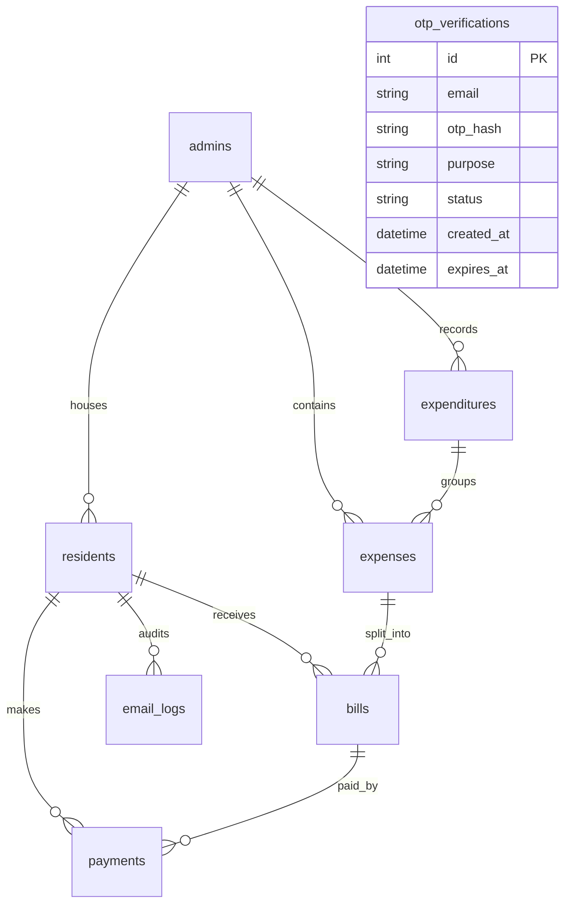

# 🏢 ApartEase — Smart Apartment Resource Management & Billing System

<div align="center">

[](https://www.python.org/)
[](https://flask.palletsprojects.com/)
[](https://react.dev/)
[](https://vite.dev/)
[](https://www.mysql.com/)
[](https://opensource.org/licenses/MIT)

**ApartEase** is a comprehensive, production-grade SaaS-style platform designed to streamline operations, automate billing splits, track utility consumption, and manage payment verification for residential societies and apartment complexes.

[Explore The Docs](file:///c:/Users/Admin/Desktop/final_year_project/docs/) · [Database Design](file:///c:/Users/Admin/Desktop/final_year_project/docs/database_schema.md)

</div>

---

## 🎯 Project Overview & Objectives

Managing shared resources in modern residential complexes presents significant challenges: manual split calculation errors, opaque expense logging, time-consuming payment verification, and scattered notifications. 

**ApartEase** solves these challenges by providing a centralized web portal:
*   **For Administrators**: An operational cockpit to manage residents, log multi-category expenditures, preview split factors, send transactional batch email notifications instantly, and verify payments via receipt attachments.
*   **For Residents**: A transparent dashboard to inspect categories, track consumption history (water, power), upload payments screenshots, and download verified, digital invoices.

### 🌟 Project Highlights
*   **Dynamic Split Factor Pricing**: Automates expense calculation based on proportional resident contribution factors (0.75x to 2.25x).
*   **High-Volume Email Delivery**: Integrated with standard Gmail SMTP to sequentially send personalized billing alerts and breakdowns.
*   **Tamper-Proof Receipt Generation**: Automatically constructs professional, formatted PDFs with vectorized branding badges using ReportLab upon admin payment verification.
*   **Double-Lock Verification Workflow**: Restricts payment verification views to billed expenditures, stopping raw saved data leaks.

---

## 🗺️ Table of Contents
*   [📖 About The Project](#-about-the-project)
*   [🚀 Key Features](#-key-features)
*   [🏛️ System Architecture](#%EF%B8%8F-system-architecture)
*   [⚙️ Tech Stack](#%EF%B8%8F-tech-stack)
*   [📂 Complete Folder Structure](#-complete-folder-structure)
*   [📊 Database Design](#-database-design)
*   [🔧 Installation Guide](#-installation-guide)
*   [🔒 Environment Variables](#-environment-variables)
*   [👥 User Roles & Permissions](#-user-roles--permissions)
*   [🖼️ Screenshots Placeholder](#%EF%B8%8F-screenshots-placeholder)
*   [🌐 Deployment Guide](#-deployment-guide)
*   [🛠️ Troubleshooting & FAQ](#%EF%B8%8F-troubleshooting--faq)
*   [🔮 Future Enhancements](#-future-enhancements)
*   [🤝 Contributing](#-contributing)
*   [📄 License](#-license)

---

## 📖 About The Project

### The Problem Statement
In residential housing societies, calculating split-shares for utility costs (e.g., diesel generator power, shared water supplies, maintenance crews, and security details) is frequently done manually using spreadsheets. This process is:
1.  **Error-Prone**: Prone to human errors, causing friction between tenants and managers.
2.  **Opaque**: Residents are only given a final number with no breakdown of the original expenditure.
3.  **Inefficient**: Collecting receipts via messaging apps and matching them to bank statements takes administrators hours.

### The ApartEase Solution
ApartEase replaces manual friction with transactional transparency. Admin-inputted expenditures are partitioned immediately using the database split factor algorithms. Residents can verify the original cost list, see their exact factor multipliers, upload screenshots, and get audit-compliant receipts. 

**Key Benefits:**
*   **95% Speedup in Billing Operations**: Dispatches personalized emails and calculates splits in seconds.
*   **Absolute Auditability**: Tracks every login, billing, and payment transaction.
*   **Premium SaaS Aesthetics**: Responsive, interactive glassmorphic UI styled for ease of use.

---

## 🚀 Key Features

### 👤 Secure Authentication & Signups
*   **Role-Based Security**: Complete segregation between Admin and Resident portals using dynamic cookie targeting (`admin_session` vs `resident_session`).
*   **Access Code Verification**: Residents register by supplying a unique apartment access code (with automatic alphanumeric normalization support), preventing orphan profile mapping.
*   **Dual OTP Safeguards**: Secure OTP verification for critical actions such as admin/resident registration, password recovery, email updates (dual OTP validation for both old and new addresses), and account disabling.
*   **Failed Attempt Rate-Limiting**: Protects login endpoints by locking accounts for 5 minutes after 5 consecutive failures.
*   **Password Policy Enforcement**: Validates that all passwords are 8-12 characters long and contain at least one uppercase, lowercase, numeric, and special character.

### 🏢 Apartment & Resident Management
*   **Admin-Vetted Onboarding**: Unverified resident requests are held in a pending queue until vetted and verified by the admin.
*   **Deactivation Grace Recovery**: Deactivated accounts (scheduled for deletion) receive a 24-hour grace window to restore. If exceeded, the account is permanently deactivated.
*   **Soft-Delete Reactivation**: Admins can soft-delete residents to keep transaction histories intact. If a soft-deleted resident attempts to log in, their account is reactivated but returned to the pending approval queue.
*   **Variable Contribution Split**: Admins can customize proportional split factor multipliers (`0.75x`, `1.0x`, `1.5x`, `2.0x`, `2.25x`) for individual resident billing allocations.

### 📊 Billing & Expense Tracking
*   **Grouped Multi-Category Expenditures**: Bundles multiple cost categories under unified date ranges to simplify resident payments.
*   **Interactive Analytics Dashboard**: Visualizes billing data via monthly category Pie charts, month-over-month comparison Bar charts, resource usage Line charts (for tracking units used like kWh or liters), and Cost vs Usage Scatter charts.
*   **Sanity Validations**: Validates that billing amounts are positive and prevents registering future dates to protect database integrity.

### 📧 Batch Notification Delivery
*   **SMTP Batch Mailing**: Sends personalized, styled HTML emails sequentially over an active, pooled SMTP connection.
*   **Permissive Error Mapping**: Handles email sending failures gracefully; if one address fails, the system logs the failure and continues dispatching to other residents.
*   **Email Delivery Logs**: Detailed database logging (`email_logs` table) recording statuses, message IDs, failure reasons, and timestamps.

### 🧾 Payments & PDF Receipts
*   **Billed-Only Verification Workflow**: Prevents verifying payments on unbilled drafts, keeping database records private.
*   **ReportLab PDF Builder**: Generates formal, vector-decorated PDF billing receipts, including Indian Rupee symbol support (automatically fallback to Helvetica/Rs. if Arial fonts are absent on the host OS), verified badge signatures, and verification timestamps.

---

## 🏛️ System Architecture

ApartEase uses a classic decoupled Model-View-Controller (MVC) style, serving a React SPA via Vite during development and a Flask static route handler during production.

```text
[ React Frontend SPA ]  ──( REST API Requests )──►  [ Flask API Handlers ]
       (Vite / Web)                                   (Routes & Blueprints)
            ▲                                                  │
            │ (Serves Bundled App)                             ▼
            └───────────────────────── [ SQLAlchemy ORM Models / MySQL DB ]
```

### Architectural & Security Middleware
*   **Dynamic Role-Based Session Interface**: The application implements a custom `RoleBasedSessionInterface` which overrides Flask's default session handling to dynamically look up and name cookie sessions (`admin_session` vs `resident_session`) depending on headers (`X-Session-Role`) and URL paths (`/api/admin` vs `/api/resident`). This prevents administrative session hijacking and allows users to run admin and resident portals side-by-side without session crossover.
*   **Global Security Headers**: A middleware filter applies strong security protections on all responses:
    *   `X-Frame-Options: DENY` (Blocks Clickjacking)
    *   `X-Content-Type-Options: nosniff` (Blocks MIME sniffing)
    *   `Referrer-Policy: strict-origin-when-cross-origin`
    *   `Content-Security-Policy (CSP)` (Restricts scripts, styles, fonts, and image sources to local or trusted CDNs to block Cross-Site Scripting).
*   **Real-time Cache Prevention**: Appends `Cache-Control: no-cache, no-store, must-revalidate` to all API responses so that client-side components always reflect real-time database transitions.

### Request Flow Workflow
1.  **Client Request**: Resident logs in and uploads a payment receipt image (Vite SPA).
2.  **Session Routing & Middleware**: The request hits Flask. The `RoleBasedSessionInterface` targets `resident_session`, matching it with the logged-in session. Global middleware verifies that CSRF/CSP constraints are met and intercepts the payload.
3.  **API Gateway & Authorization**: The request is routed to the `payment.py` Blueprint. The `login_required` and role decorators check permissions, ensuring the resident belongs to the requested apartment context.
4.  **Business Logic**: The payment controller processes the receipt image upload, validates its extension types (preventing arbitrary script execution), saves the file in `static/uploads`, and updates the payment row to `'paid'`.
5.  **Database Commit & Response**: SQLAlchemy commits the changes to MySQL, triggers no-cache headers on the response, and returns a JSON payload to update the frontend state.

---

## ⚙️ Tech Stack

### Frontend Core
| Technology | Version | Purpose |
| :--- | :--- | :--- |
| **React** | `^19.1.0` | Core declarative components framework. |
| **React Router DOM** | `^7.15.1` | Client-side routing engine. |
| **Chart.js** | `^4.5.1` | Aggregates and plots usage analytics. |
| **react-chartjs-2** | `^5.3.1` | React wrapper for Chart.js dashboards. |
| **Vanilla CSS** | Standard | Modern styling using a custom dark/glassmorphic system. |

### Backend Service
| Technology | Version | Purpose |
| :--- | :--- | :--- |
| **Python** | `^3.12` | Core runtime platform. |
| **Flask** | `3.1.0` | Microservices API framework. |
| **Flask-SQLAlchemy** | `3.1.1` | Relational Object Mapper (ORM). |
| **Flask-Login** | `0.6.3` | Admin/Resident session management. |
| **ReportLab** | `4.5.1` | Transactional PDF receipt builder. |
| **bcrypt** | `^4.2.1` | Secure password and OTP hashing library. |
| **PyMySQL** | `^1.1.1` | Pure-Python MySQL client driver. |

---

## 📂 Complete Folder Structure

```text
final_year_project/
├── database/                    # Relational SQL schemas and migrations
│   ├── schema.sql               # Core DDL tables script
│   └── migrate_*.py             # Custom DB update migrations
├── docs/                        # Architectural specifications and guides (templates)
│   ├── database_schema.md       # Interactive ER diagrams and maps
│   └── OTP_README.md            # SMTP OTP configurations
├── frontend/                    # Single-Page-Application source
│   ├── public/                  # Public web graphics and templates
│   ├── src/                     # React component components and context
│   │   ├── components/          # Reusable Glassmorphic UI library
│   │   ├── hooks/               # Custom React hooks
│   │   ├── pages/               # Views (Dashboard, Settings, Bill Distribution)
│   │   │   ├── admin/           # Admin-only pages (Analytics, Payment Verification, Resident List)
│   │   │   ├── auth/            # Registration and login forms for both roles
│   │   │   └── resident/        # Resident dashboards, settings, and histories
│   │   ├── services/            # Client-side API abstraction wrappers
│   │   └── utils/               # Formatting and calculation helpers
│   └── package.json             # NPM package lists
├── models/                      # SQLAlchemy database models mapping to MySQL tables
│   ├── __init__.py              # Central db connector and registration exports
│   ├── admin.py                 # Admin profile, UPI ID, deactivation request, credentials
│   ├── resident.py              # Resident profile, active status, split factors
│   ├── expenditure.py           # Monthly billing sessions and base rate calculations
│   ├── expense.py               # Cost categories and resource usage units
│   ├── bill.py                  # Individual tenant invoice records
│   ├── payment.py               # Payment status, receipt paths, verification state
│   ├── email_log.py             # Transactional batch delivery logs
│   └── otp_verification.py      # Secure OTP verification records (bcrypt hashes)
├── routes/                      # API controllers (Flask Blueprints & helper services)
│   ├── auth.py                  # Gatekeepers (Login/Register, profile updates, security resets)
│   ├── admin.py                 # Management APIs (onboarding, payment settings, split values)
│   ├── bill.py                  # Bill calculations, date filtering, and generation commands
│   ├── payment.py               # Verification uploads and ReportLab PDF receipt builder
│   ├── email_service.py         # Billing notification SMTP pipelines and log commits
│   ├── analytics.py             # Category breakdown, MoM comparison, cost vs usage APIs
│   └── otp_service.py           # Verification code lifecycles, rate limiting, and HTML templates
├── static/                      # Flask static bundles and storage
│   ├── react/                   # Production compiled Vite assets
│   └── uploads/                 # Local directory for user receipt and QR code images
├── .env.example                 # Environment configuration template
├── .gitignore                   # Exclusions list
├── app.py                       # Main application entry point (registers session role interface and CSP)
├── config.py                    # Environment settings loader
├── requirements.txt             # Python libraries
└── README.md                    # Core project presentation page
```

---

## 📊 Database Design

The relational database architecture is defined in MySQL and managed via Flask-SQLAlchemy.



### Table Specifications
1.  **admins**: Stores administrative profile credentials, unique `access_code` for residents, `upi_id`, detailed bank configurations (`bank_name`, `account_holder_name`, `account_number`, `ifsc_code`, `branch_name`), custom `qr_code` path, and `deactivation_requested_at` grace timestamp.
2.  **residents**: Manages resident credentials, `house_number`, verified state (`is_verified`), active state (`is_active` for soft-deletes), deactivation grace timestamps, and `split_number` (representing the proportional contribution factor).
3.  **expenditures**: Groups multiple monthly category expenses under `from_date` and `to_date` ranges, storing the `total_amount`, total apartment count (`total_houses`), and the calculated baseline split `per_person_amount`.
4.  **expenses**: Tracks individual utility costs, supporting category enums (`'electricity'`, `'water'`, `'maintenance'`, `'security'`, `'elevator'`, `'other'`), custom category labels, amounts, and specific resource units (`units_used`, `unit_type`). Optionally linked to a parent `expenditure_id`.
5.  **bills**: Links a single resident to an expense, calculating their custom portion (`split_amount`) factoring in their resident contribution split number.
6.  **payments**: Maps to `bills`, storing approval state (`status`: `'pending'`, `'paid'`, `'rejected'`), user receipt screenshot file paths (`receipt_image`), verification confirmation (`verified` boolean), and update timestamps.
7.  **email_logs**: Audits batch notification transactions, storing the `recipient_email`, foreign keys to resident/bill/expenditure, status (`'success'` / `'failed'`), message reference IDs, and failure detail logs.
8.  **otp_verifications**: Standalone security log mapping verification requests, containing the hashed verification code (`otp_hash`), purpose (e.g. `'admin-register'`, `'change-email-current'`), validation `status` (`'pending'`, `'verified'`, `'expired'`, `'used'`), and expiration timestamps.

---

## 🔧 Installation Guide

### Prerequisites
*   **Python**: `3.10` or higher
*   **Node.js**: `18.x` or higher
*   **MySQL Server**: `8.0` or higher

### Step 1: Clone the Repository
```bash
git clone https://github.com/your-username/apartease.git
cd apartease
```

### Step 2: Set Up Backend Environment & Dependencies
```bash
# Create virtual environment
python -m venv venv

# Activate virtual environment (Windows)
venv\Scripts\activate

# Activate virtual environment (macOS/Linux)
source venv/bin/activate

# Install libraries
pip install -r requirements.txt
```

### Step 3: Set Up Frontend Environment & Dependencies
```bash
cd frontend
npm install
cd ..
```

---

## 🔒 Environment Variables

Create a `.env` file in the project root based on `.env.example`:

```env
# Flask Setup
SECRET_KEY=generate-a-strong-random-key-string
FLASK_DEBUG=True
SESSION_COOKIE_SECURE=False

# Database Credentials
DB_HOST=127.0.0.1
DB_PORT=3306
DB_USER=root
DB_PASSWORD=your_mysql_secure_password
DB_NAME=apartment_mgmt

# Upload Folder Constants
UPLOAD_FOLDER=static/uploads
MAX_CONTENT_LENGTH=5242880

# SMTP Server Configurations (Email OTP)
SMTP_SERVER=smtp.gmail.com
SMTP_PORT=465
SMTP_USERNAME=your-gmail@gmail.com
SMTP_PASSWORD=your-gmail-app-password
SMTP_USE_SSL=True
EMAIL_FROM=apartease.billing@gmail.com

# SMTP Billing Configurations
SMTP_HOST=smtp.gmail.com
SMTP_PORT=465
SMTP_EMAIL=your-email@gmail.com
SMTP_PASSWORD=your-app-password
APP_URL=http://localhost:5000
```

---

## 🔧 Database Setup
1.  Log in to your local MySQL console:
    ```sql
    mysql -u root -p
    ```
2.  Import the database schema:
    ```sql
    SOURCE database/schema.sql;
    ```
3.  Upon application startup, Flask-SQLAlchemy's `db.create_all()` will automatically run and sync any missing models (such as `email_logs`).

---

## ▶️ Running the Application

### Running Backend (Development)
Ensure the virtual environment is active in your terminal, then run:
```bash
python app.py
```
This runs the Flask server on `http://127.0.0.1:5000/`.

### Running Frontend (Development)
Open a new terminal window, navigate to the frontend folder, and run:
```bash
cd frontend
npm run dev
```
This runs the Vite server on `http://localhost:5173/`, proxying API calls to the backend on `:5000`.

---

## 👥 User Roles & Permissions

### Onboarding & Authentication Flows
*   **Registration Security**: Admins register directly and define their unique access code. Residents must supply this access code to join. Both registrations require OTP email verification before records are committed.
*   **Onboarding Verification**: All registered residents are placed in a pending state and cannot log in. Admins must manually approve residents under the "Verify Residents" screen to authorize access.
*   **Login Lock Policy**: If any user fails login credentials 5 consecutive times, they are locked out of the system for 5 minutes.
*   **Deactivation Grace Recovery**: When a user disables their account, the record is flagged with a 24-hour grace timestamp. If they log in within 24 hours, they are offered an option to restore their account instantly. Otherwise, the account is permanently deactivated.
*   **Resident Reactivation Queue**: When admins soft-delete an active resident, their `is_active` is flagged False. If that resident attempts to log in again, their `is_active` status is restored to True, but their `is_verified` flag is set to False, immediately routing them back to the admin's pending approval queue.

### 👑 Administrator Role
*   **Permitted Actions**:
    *   Verify or reject resident onboardings in the pending approval queue.
    *   Soft-delete verified residents to restrict access while preserving billing logs.
    *   Adjust resident split factor coefficients (`0.75x`, `1.0x`, `1.5x`, `2.0x`, `2.25x`).
    *   Record society expenditures with multiple custom category breakdowns.
    *   Edit/update unsent expenditure details and delete old linked expenses automatically.
    *   Distribute monthly bills with proportional split factor allocations.
    *   Trigger automated SMTP batch billing alerts to all billed residents.
    *   Update payment settings (UPI ID, bank particulars, QR codes) with safe file type checks.
    *   Verify transaction receipts and approve or reject resident payments.

### 🏠 Resident Role
*   **Permitted Actions**:
    *   Register using their apartment's unique access code (with case/space normalization).
    *   View current billing status and previous breakdowns (electricity, water, maintenance).
    *   Filter historical bills by year and custom date range.
    *   Track historical consumption and split costs using interactive dashboards and charts.
    *   Upload transaction screenshots to submit payment.
    *   Manage profile settings (update name, change password with policy checks, update email via double-OTP verification).
    *   Schedule account deactivation with a 24-hour recovery grace window.
    *   Download verified, professional PDF billing receipts with verified badge signatures.

---

## 🖼️ Screenshots Placeholder

Below are placeholder layouts mapping out the glassmorphic designs:

| Section | Graphic Representation |
| :--- | :--- |
| **Landing Page** | `[ https://raw.githubusercontent.com/username/repo/main/screenshots/landing.png ]` |
| **Admin Cockpit** | `[ https://raw.githubusercontent.com/username/repo/main/screenshots/admin_dashboard.png ]` |
| **Distribution** | `[ https://raw.githubusercontent.com/username/repo/main/screenshots/bill_distribution.png ]` |
| **Resident Dashboard** | `[ https://raw.githubusercontent.com/username/repo/main/screenshots/resident_dashboard.png ]` |

---

## 🛠️ Troubleshooting & FAQ

#### Q: The server fails with `OperationalError: Unknown column 'email_logs.recipient_email'`.
**A**: An older database schema lacks the new audit log structure. Drop your local `email_logs` table, restart `app.py`, and the SQLAlchemy engine will automatically create it fresh.
```sql
DROP TABLE IF EXISTS email_logs;
```

#### Q: Emails are failing to deliver.
**A**: Double-check your `.env` `SMTP_EMAIL` and `SMTP_PASSWORD`. Ensure SMTP access is enabled on your email provider and your credentials are correct.

#### Q: I am not receiving OTP verification emails during development.
**A**: If SMTP credentials are not configured in your `.env` file, the application falls back to development logging. Check your Flask server console/terminal outputs to find the printed OTP verification codes.

#### Q: The Indian Rupee symbol is displaying as "Rs." instead of "₹" in downloaded PDF receipts.
**A**: ReportLab constructs "₹" using the system's local TrueType font files. The system attempts to load `Arial` and `Arial-Bold` from Windows fonts directory. If the TrueType fonts are not available on the hosting operating system, it falls back to standard Helvetica and displays "Rs. " for formatting safety.

#### Q: Residents cannot log in and receive "Admin verification is required" errors.
**A**: Upon registration, resident accounts are inactive/unverified by default. The administrator must log into the Admin cockpit, go to "Verify Residents", and approve their onboarding request.

#### Q: My login request returns a "Too many login attempts" error.
**A**: To protect accounts from brute-force exploits, the endpoint blocks logins for 5 minutes after 5 failed password attempts. Wait 5 minutes for the rate-limit window to reset automatically.

---

## 🔄 Recent Updates & Optimizations

ApartEase has undergone several major upgrades to reach a production-ready, secure, and highly transparent state:
*   **Interactive Analytics Dashboards**: Integrated frontend `react-chartjs-2` widgets coupled with database-driven `/api/analytics` aggregators, showcasing monthly category breakdowns (Pie), MoM billing progressions (Bar), resource consumption tracks (Line), and cost correlation patterns (Scatter).
*   **Dual-OTP Profile Security**: Built multi-step OTP procedures verifying email changes by confirming ownership of both the current and new email addresses sequentially.
*   **Indian Rupee PDF Receipt Builder**: Enhanced the PDF generator with vector graphics branding, table-based breakdowns, green verified status alerts, and cross-platform Arial/Helvetica font bindings.
*   **Exploit Sanity Protections**: Implemented checks blocking negative expense inputs, future billing periods, and unsafe file extension uploads.
*   **Login Lock Rate-Limiter**: Added in-memory tracking blocking brute-force attacks after 5 password failures.
*   **Deactivation & Recovery Grace Windows**: Implemented deactivation scheduling with 24-hour restoration windows, as well as automatic queue routing on soft-deleted account logins.
*   **SMTP Connection Pooling**: Optimized sequential dispatching in SMTP batch processes to avoid connection overhead and timeouts during large society billing alerts.

---

## 🔮 Future Enhancements
*   **Payment Gateway Integration**: Direct Stripe, Razorpay, or UPI link creation for single-click checkouts.
*   **Vulnerability Scans**: Incorporate automated security filters for uploaded payment receipts.
*   **Shared Maintenance Ledger**: Provide an online messaging system for ticket updates.

---

## 🤝 Contributing
Contributions are what make the open source community such an amazing place to learn, inspire, and create. Any contributions you make are **greatly appreciated**.

1.  Fork the Project.
2.  Create your Feature Branch (`git checkout -b feature/AmazingFeature`).
3.  Commit your Changes (`git commit -m 'Add some AmazingFeature'`).
4.  Push to the Branch (`git push origin feature/AmazingFeature`).
5.  Open a Pull Request.

---

## 📄 License
Distributed under the MIT License. See [LICENSE](LICENSE) for more information.
