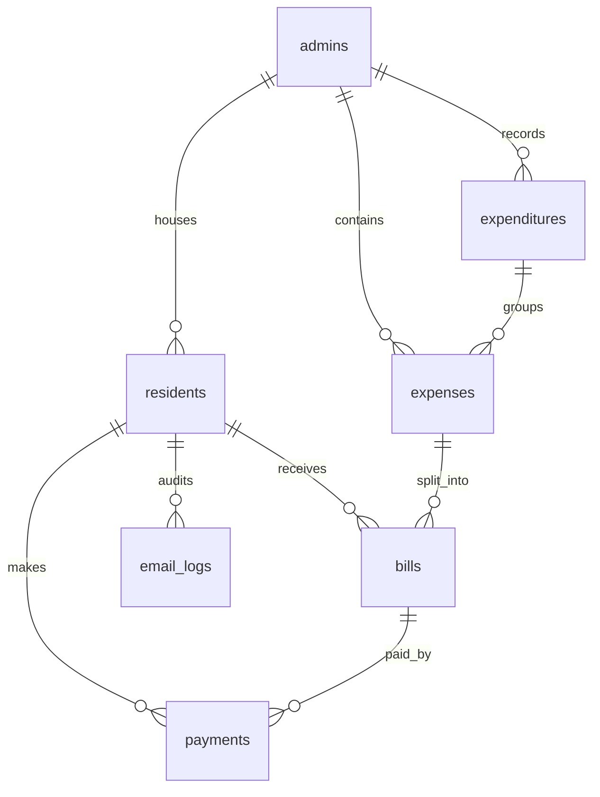

# 🏢 ApartEase — Smart Apartment Resource Management & Billing System

<div align="center">

[](https://www.python.org/)
[](https://flask.palletsprojects.com/)
[](https://react.dev/)
[](https://vite.dev/)
[](https://www.mysql.com/)
[](https://opensource.org/licenses/MIT)

**ApartEase** is a comprehensive, production-grade SaaS-style platform designed to streamline operations, automate billing splits, track utility consumption, and manage payment verification for residential societies and apartment complexes.

[Explore The Docs](file:///c:/Users/Admin/Desktop/final_year_project/docs/) · [Database Design](file:///c:/Users/Admin/Desktop/final_year_project/docs/database_schema.md) · [Resend Guide](file:///c:/Users/Admin/Desktop/final_year_project/docs/RESEND_BATCH_EMAIL_SETUP_GUIDE.md)

</div>

---

## 🎯 Project Overview & Objectives

Managing shared resources in modern residential complexes presents significant challenges: manual split calculation errors, opaque expense logging, time-consuming payment verification, and scattered notifications. 

**ApartEase** solves these challenges by providing a centralized web portal:
*   **For Administrators**: An operational cockpit to manage residents, log multi-category expenditures, preview split factors, send transactional batch email notifications instantly, and verify payments via receipt attachments.
*   **For Residents**: A transparent dashboard to inspect categories, track consumption history (water, power), upload payments screenshots, and download verified, digital invoices.

### 🌟 Project Highlights
*   **Dynamic Split Factor Pricing**: Automates expense calculation based on proportional resident contribution factors (0.75x to 2.25x).
*   **High-Volume Email Delivery**: Integrated with official **Resend Python SDK and Batch API** to chunk, secure via idempotency, and permissive-send up to 100 emails per request.
*   **Tamper-Proof Receipt Generation**: Automatically constructs professional, formatted PDFs with vectorized branding badges using ReportLab upon admin payment verification.
*   **Double-Lock Verification Workflow**: Restricts payment verification views to billed expenditures, stopping raw saved data leaks.

---

## 🗺️ Table of Contents
*   [📖 About The Project](#-about-the-project)
*   [🚀 Key Features](#-key-features)
*   [🏛️ System Architecture](#%EF%B8%8F-system-architecture)
*   [⚙️ Tech Stack](#%EF%B8%8F-tech-stack)
*   [📂 Complete Folder Structure](#-complete-folder-structure)
*   [📊 Database Design](#-database-design)
*   [🔧 Installation Guide](#-installation-guide)
*   [🔒 Environment Variables](#-environment-variables)
*   [👥 User Roles & Permissions](#-user-roles--permissions)
*   [🖼️ Screenshots Placeholder](#%EF%B8%8F-screenshots-placeholder)
*   [🌐 Deployment Guide](#-deployment-guide)
*   [🛠️ Troubleshooting & FAQ](#%EF%B8%8F-troubleshooting--faq)
*   [🔮 Future Enhancements](#-future-enhancements)
*   [🤝 Contributing](#-contributing)
*   [📄 License](#-license)

---

## 📖 About The Project

### The Problem Statement
In residential housing societies, calculating split-shares for utility costs (e.g., diesel generator power, shared water supplies, maintenance crews, and security details) is frequently done manually using spreadsheets. This process is:
1.  **Error-Prone**: Prone to human errors, causing friction between tenants and managers.
2.  **Opaque**: Residents are only given a final number with no breakdown of the original expenditure.
3.  **Inefficient**: Collecting receipts via messaging apps and matching them to bank statements takes administrators hours.

### The ApartEase Solution
ApartEase replaces manual friction with transactional transparency. Admin-inputted expenditures are partitioned immediately using the database split factor algorithms. Residents can verify the original cost list, see their exact factor multipliers, upload screenshots, and get audit-compliant receipts. 

**Key Benefits:**
*   **95% Speedup in Billing Operations**: Dispatches personalized emails and calculates splits in seconds.
*   **Absolute Auditability**: Tracks every login, billing, and payment transaction.
*   **Premium SaaS Aesthetics**: Responsive, interactive glassmorphic UI styled for ease of use.

---

## 🚀 Key Features

### 👤 Secure Authentication & Signups
*   **Role-Based Security**: Complete segregation between Admin and Resident portals.
*   **Access Code Verification**: Residents join their exact apartment complex by supplying a unique adminaccess code, preventing orphan profile mapping.
*   **Dual OTP Safeguards**: Integrated SMTP OTP verification protects critical account modifications.

### 🏢 Apartment & Resident Management
*   **Admin-Vetted Onboarding**: Unverified resident requests are held in a pending queue until approved.
*   **Deactivation Grace Recovery**: Deactivated accounts receive a 24-hour grace window to restore. If exceeded, residents are automatically routed to the pending approval queue.

### 📊 Billing & Expense Tracking
*   **Grouped Multi-Category Expenditures**: Bundles various categories (water, electricity, elevator upkeep) under unified billing periods.
*   **Aesthetic Simplified Preview**: Bill distribution preview displays clear cost categories and absolute totals, omitting confusing intermediate splits.

### 📧 Batch Notification Delivery
*   **Resend Batch API**: Sends up to 100 personalized billing emails in a single request.
*   **Permissive Error Mapping**: Valid entries compile and queue successfully even if other addresses are malformed.
*   **24-Hour Idempotency Safeguards**: Prevent accidental duplicate email blasts during server retries.

### 🧾 Payments & PDF Receipts
*   **Billed-Only Verification Workflow**: Limits payment reviews to billed entries, keeping unbilled drafts private.
*   **ReportLab PDF Builder**: Generates digital receipts with vector brand signatures.

---

## 🏛️ System Architecture

ApartEase uses a classic decoupled Model-View-Controller (MVC) style, serving a React SPA via Vite during development and a Flask static route handler during production.

```text
[ React Frontend SPA ]  ──( REST API Requests )──►  [ Flask API Handlers ]
       (Vite / Web)                                   (Routes & Blueprints)
            ▲                                                  │
            │ (Serves Bundled App)                             ▼
            └───────────────────────── [ SQLAlchemy ORM Models / MySQL DB ]
```

### Request Flow Workflow
1.  **Client Request**: Resident logs in and uploads a payment receipt image (Vite SPA).
2.  **API Gateway**: Flask middleware matches the session cookie and directs the payload to `payment.py` Blueprint.
3.  **Business Logic**: The handler checks the record and updates the status to `'paid'` in the database.
4.  **Database Sync**: The SQLAlchemy engine commits changes to MySQL and returns a JSON payload to the client.

---

## ⚙️ Tech Stack

### Frontend Core
| Technology | Version | Purpose |
| :--- | :--- | :--- |
| **React** | `^19.1.0` | Core declarative components framework. |
| **React Router DOM** | `^7.15.1` | Client-side routing engine. |
| **Chart.js** | `^4.5.1` | Aggregates and plots usage analytics. |
| **Vanilla CSS** | Standard | Modern styling using a custom dark/glassmorphic system. |

### Backend Service
| Technology | Version | Purpose |
| :--- | :--- | :--- |
| **Python** | `^3.12` | Core runtime platform. |
| **Flask** | `3.1.0` | Microservices API framework. |
| **Flask-SQLAlchemy** | `3.1.1` | Relational Object Mapper (ORM). |
| **Flask-Login** | `0.6.3` | Admin/Resident session management. |
| **Resend SDK** | `2.29.0` | High-volume batch email delivery. |
| **ReportLab** | `4.5.1` | Transactional PDF receipt builder. |

---

## 📂 Complete Folder Structure

```text
final_year_project/
├── database/                    # Relational SQL schemas and migrations
│   ├── schema.sql               # Core DDL tables script
│   └── migrate_*.py             # Custom DB update migrations
├── docs/                        # Architectural specifications and guides
│   ├── database_schema.md       # Interactive ER diagrams and maps
│   ├── OTP_README.md            # SMTP OTP configurations
│   └── RESEND_BATCH_EMAIL_*.md  # Resend setup specifications
├── frontend/                    # Single-Page-Application source
│   ├── public/                  # Public web graphics and templates
│   ├── src/                     # React component components and context
│   │   ├── components/          # Reusable Glassmorphic UI library
│   │   ├── pages/               # Views (Dashboard, Settings, Bill Distribution)
│   │   └── services/            # Client-side API abstraction wrappers
│   └── package.json             # NPM package lists
├── models/                      # SQLAlchemy database models mapping to MySQL tables
│   ├── __init__.py              # Central db connector and registration exports
│   ├── admin.py                 # Admin profile
│   ├── resident.py              # Resident profile and split factors
│   ├── expenditure.py           # Monthly billing sessions
│   ├── expense.py               # Cost categories
│   ├── bill.py                  # Individual tenant invoice
│   ├── payment.py               # Payment status
│   └── email_log.py             # Transactional batch delivery logs
├── routes/                      # API controllers (Flask Blueprints)
│   ├── auth.py                  # Gatekeepers (Login/Register)
│   ├── admin.py                 # Management APIs
│   ├── bill.py                  # Bill calculations and delivery commands
│   ├── payment.py               # Verification uploads and PDF generator
│   └── email_service.py         # Resend batch chunking pipelines
├── static/                      # Flask static bundles and storage
│   ├── react/                   # Production compiled Vite assets
│   └── uploads/                 # Local directory for user receipt images
├── .env.example                 # Environment configuration template
├── .gitignore                   # Exclusions list
├── app.py                       # Main application entry point
├── config.py                    # Environment settings loader
├── requirements.txt             # Python libraries
└── README.md                    # Core project presentation page
```

---

## 📊 Database Design

The relational database architecture is defined in MySQL and managed via Flask-SQLAlchemy.



### Table Specifications
1.  **admins**: Stores administrative profile, unique access code, UPI ID, and bank details.
2.  **residents**: Manages resident details, verified state, and `split_number` (contribution factor).
3.  **expenditures**: Represents a monthly billing period session with totals and per-person base rates.
4.  **expenses**: Tracks categories (electricity, water, maintenance) linked to an expenditure.
5.  **bills**: Links a single resident to an expense, defining their calculated split amount.
6.  **payments**: Tracks payment receipt image paths, approval status (`pending`, `approved`, `rejected`), and timestamps.
7.  **email_logs**: Audits batch emailing transactions, storing statuses, message IDs, and failure reasons.

---

## 🔧 Installation Guide

### Prerequisites
*   **Python**: `3.10` or higher
*   **Node.js**: `18.x` or higher
*   **MySQL Server**: `8.0` or higher

### Step 1: Clone the Repository
```bash
git clone https://github.com/your-username/apartease.git
cd apartease
```

### Step 2: Set Up Backend Environment & Dependencies
```bash
# Create virtual environment
python -m venv venv

# Activate virtual environment (Windows)
venv\Scripts\activate

# Activate virtual environment (macOS/Linux)
source venv/bin/activate

# Install libraries
pip install -r requirements.txt
```

### Step 3: Set Up Frontend Environment & Dependencies
```bash
cd frontend
npm install
cd ..
```

---

## 🔒 Environment Variables

Create a `.env` file in the project root based on `.env.example`:

```env
# Flask Setup
SECRET_KEY=generate-a-strong-random-key-string
FLASK_DEBUG=True

# Database Credentials
DB_HOST=127.0.0.1
DB_PORT=3306
DB_USER=root
DB_PASSWORD=your_mysql_secure_password
DB_NAME=apartment_mgmt

# Upload Folder Constants
UPLOAD_FOLDER=static/uploads
MAX_CONTENT_LENGTH=5242880

# SMTP Server Configurations (Email OTP)
SMTP_SERVER=smtp.gmail.com
SMTP_PORT=465
SMTP_USERNAME=your-gmail@gmail.com
SMTP_PASSWORD=your-gmail-app-password
SMTP_USE_SSL=True

# Resend API Details
RESEND_API_KEY=re_your_copied_api_key_from_dashboard
RESEND_FROM_EMAIL=billing@yourdomain.com
APP_URL=http://localhost:5000
```

---

## 🔧 Database Setup
1.  Log in to your local MySQL console:
    ```sql
    mysql -u root -p
    ```
2.  Import the database schema:
    ```sql
    SOURCE database/schema.sql;
    ```
3.  Upon application startup, Flask-SQLAlchemy's `db.create_all()` will automatically run and sync any missing models (such as `email_logs`).

---

## ▶️ Running the Application

### Running Backend (Development)
Ensure the virtual environment is active in your terminal, then run:
```bash
python app.py
```
This runs the Flask server on `http://127.0.0.1:5000/`.

### Running Frontend (Development)
Open a new terminal window, navigate to the frontend folder, and run:
```bash
cd frontend
npm run dev
```
This runs the Vite server on `http://localhost:5173/`, proxying API calls to the backend on `:5000`.

---

## 👥 User Roles & Permissions

### 👑 Administrator Role
*   **Permitted Actions**:
    *   Verify or reject resident onboardings.
    *   Adjust resident split factor coefficients (`0.75x`, `1.0x`, `1.5x`, `2.0x`, `2.25x`).
    *   Record society expenditures and categories.
    *   Edit unsent expenditure details.
    *   Distribute monthly bills with automated split calculations.
    *   Trigger automated Resend batch email alerts.
    *   Verify transaction receipts and approve/reject payments.

### 🏠 Resident Role
*   **Permitted Actions**:
    *   Register using their apartment's unique access code.
    *   View current billing status and previous breakdowns (water, power).
    *   Track historical trends using custom usage charts.
    *   Upload transaction screenshots to submit payment.
    *   Download verified, professional PDF billing receipts.

---

## 🖼️ Screenshots Placeholder

Below are placeholder layouts mapping out the glassmorphic designs:

| Section | Graphic Representation |
| :--- | :--- |
| **Landing Page** | `[ https://raw.githubusercontent.com/username/repo/main/screenshots/landing.png ]` |
| **Admin Cockpit** | `[ https://raw.githubusercontent.com/username/repo/main/screenshots/admin_dashboard.png ]` |
| **Distribution** | `[ https://raw.githubusercontent.com/username/repo/main/screenshots/bill_distribution.png ]` |
| **Resident Dashboard** | `[ https://raw.githubusercontent.com/username/repo/main/screenshots/resident_dashboard.png ]` |

---

## 🛠️ Troubleshooting & FAQ

#### Q: The server fails with `OperationalError: Unknown column 'email_logs.recipient_email'`.
**A**: An older database schema lacks the new audit log structure. Drop your local `email_logs` table, restart `app.py`, and the SQLAlchemy engine will automatically create it fresh.
```sql
DROP TABLE IF EXISTS email_logs;
```

#### Q: Emails are failing to deliver with `Unauthorized` alerts.
**A**: Double-check your `.env` `RESEND_API_KEY`. If using sandbox credentials, ensure you are sending test emails **only to your registered account owner's email address**.

---

## 🔮 Future Enhancements
*   **Payment Gateway Integration**: Direct Stripe, Razorpay, or UPI link creation for single-click checkouts.
*   **Vulnerability Scans**: Incorporate automated security filters for uploaded payment receipts.
*   **Shared Maintenance Ledger**: Provide an online messaging system for ticket updates.

---

## 🤝 Contributing
Contributions are what make the open source community such an amazing place to learn, inspire, and create. Any contributions you make are **greatly appreciated**.

1.  Fork the Project.
2.  Create your Feature Branch (`git checkout -b feature/AmazingFeature`).
3.  Commit your Changes (`git commit -m 'Add some AmazingFeature'`).
4.  Push to the Branch (`git push origin feature/AmazingFeature`).
5.  Open a Pull Request.

---

## 📄 License
Distributed under the MIT License. See [LICENSE](LICENSE) for more information.
